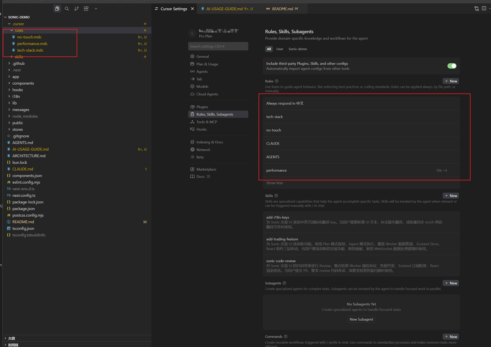
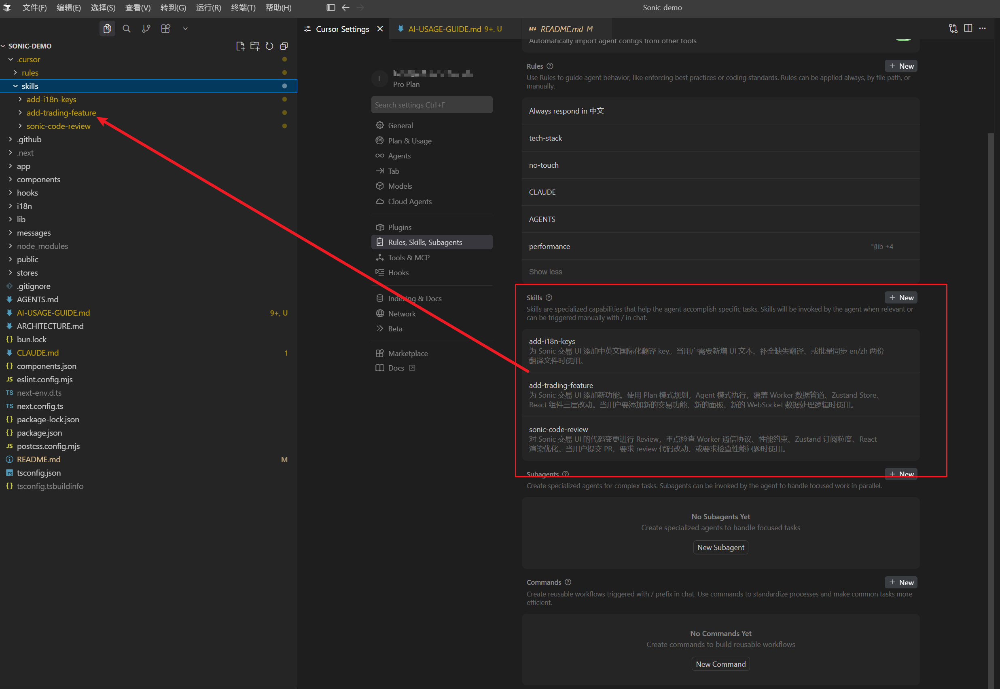
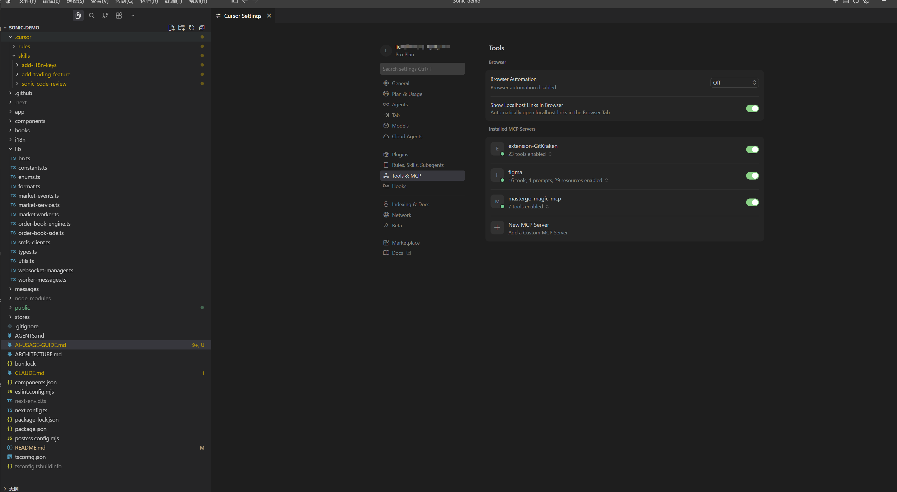
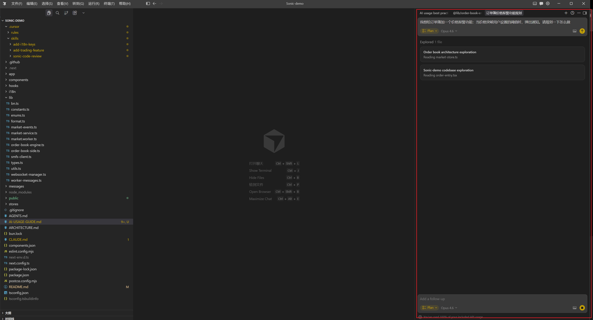
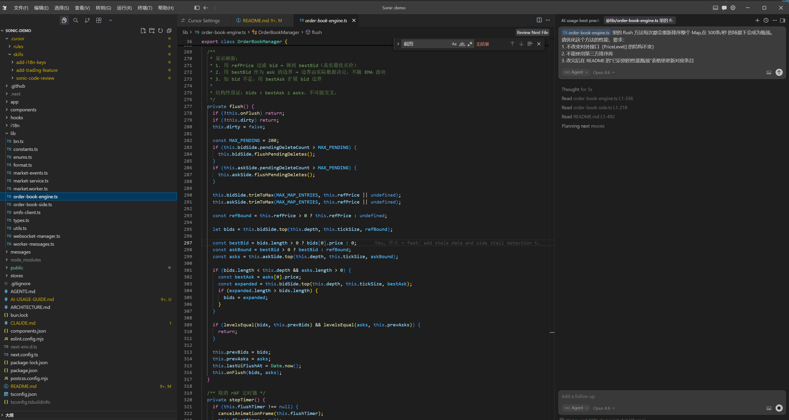

# Cursor AI 使用实战手册

> 我的真实使用情况 + 最佳实践总结，帮你少走弯路，真正把 AI 用起来。

---

## 目录

1. [我是怎么用 AI 的](#1-我是怎么用-ai-的)
2. [Cursor 功能全景](#2-cursor-功能全景)
3. [Rules — 让 AI 记住你的规矩](#3-rules--让-ai-记住你的规矩)
4. [Skills — 可复用的 AI 技能包](#4-skills--可复用的-ai-技能包)
5. [MCP — 给 AI 接上外部工具](#5-mcp--给-ai-接上外部工具)
6. [Plan 模式 — 先想清楚再动手](#6-plan-模式--先想清楚再动手)
7. [Agent 模式 — 让 AI 自主完成复杂任务](#7-agent-模式--让-ai-自主完成复杂任务)
8. [实战案例：本项目是怎么做的](#8-实战案例本项目是怎么做的)
9. [踩坑与反思](#9-踩坑与反思)
10. [我的 AI 工作流总结](#10-我的-ai-工作流总结)

---

## 1. 我是怎么用 AI 的

说实话，刚开始用 AI 写代码，效果并不好——AI 经常给出过时的 API、错误的框架用法，或者一段看起来正确、跑起来报错的代码。后来慢慢摸索出一套用法，AI 才真正变成了提效工具。

### 我的日常 AI 使用场景

| 场景 | 频率 | 效果 |
|---|---|---|
| 搜索替代（"这个 API 怎么用"） | 每天多次 | ⭐⭐⭐⭐ 比 Google 快很多 |
| 写样板代码（接口、组件骨架） | 每天 | ⭐⭐⭐⭐⭐ 节省大量时间 |
| 调试报错（把错误贴给 AI） | 经常 | ⭐⭐⭐⭐ 命中率很高 |
| 代码重构（"帮我优化这段逻辑"） | 不定期 | ⭐⭐⭐ 需要审查 |
| 写文档注释 | 不定期 | ⭐⭐⭐⭐⭐ 比自己写好 |
| 复杂架构设计 | 偶尔 | ⭐⭐⭐ 仅供参考，主要靠自己 |

### 核心认知

**AI 不是搜索引擎，也不是自动驾驶，它是一个需要你"带着走"的结对编程伙伴。**

你给的上下文越清晰、约束越明确，它给出的结果越好。

---

## 2. Cursor 功能全景

Cursor 在普通编辑器的基础上，叠加了一套 AI 能力体系。下面是整体功能地图：

```
┌─────────────────────────────────────────────────────────┐
│                    Cursor AI 能力体系                     │
│                                                         │
│  ┌─────────────┐   ┌─────────────┐   ┌──────────────┐  │
│  │   Rules     │   │   Skills    │   │    MCP       │  │
│  │ （行为约束） │   │ （技能包）   │   │ （外部工具）  │  │
│  └──────┬──────┘   └──────┬──────┘   └──────┬───────┘  │
│         │                 │                  │          │
│         └─────────────────┴──────────────────┘          │
│                           │                             │
│                    ┌──────▼──────┐                      │
│                    │  AI 大模型   │                      │
│                    └──────┬──────┘                      │
│                           │                             │
│            ┌──────────────┼──────────────┐              │
│            │              │              │              │
│      ┌─────▼────┐  ┌──────▼─────┐  ┌────▼────┐         │
│      │ Ask 模式  │  │ Plan 模式   │  │ Agent   │         │
│      │（问答）   │  │ （规划）    │  │ 模式    │         │
│      └──────────┘  └────────────┘  └─────────┘         │
└─────────────────────────────────────────────────────────┘
```

---

## 3. Rules — 让 AI 记住你的规矩

### 什么是 Rules

Rules 是写给 AI 的"长期记忆"。不用每次对话都重复说明，AI 会在每次回答前自动读取并遵守。

### 存放位置

```
.cursor/rules/     ← 项目级规则（只对当前项目生效）
AGENTS.md          ← 兼容多种 AI 工具（Cursor、Claude Code 等）
CLAUDE.md          ← 专门针对 Claude 的规则（可以转引 AGENTS.md）
```




### 本项目的 Rules 示例

本项目的 `AGENTS.md` 写了一条关键规则：

```markdown
# This is NOT the Next.js you know

This version has breaking changes — APIs, conventions, and file structure
may all differ from your training data. Read the relevant guide in
`node_modules/next/dist/docs/` before writing any code.
Heed deprecation notices.
```

**为什么要写这条？**

Next.js 16 有大量破坏性变更（App Router、新的 `use` API 等），AI 的训练数据中大多是 Next.js 13/14 的写法。如果不告诉 AI，它很容易给出旧版本的代码。加上这条规则后，AI 会主动去读项目的文档，而不是凭"印象"写代码。

### Rules 的最佳实践

**规则要写什么：**

```markdown
# 技术栈约束
- 使用 Bun 而不是 npm/pnpm
- 使用 Tailwind CSS v4 的新语法（不是 v3）
- 组件使用 shadcn/ui，不要引入新 UI 库

# 代码风格
- 所有组件使用具名导出，不用 default export
- 类型定义放在 lib/types.ts，不要分散在各组件
- 禁止使用 any，必须有明确类型

# 禁止行为
- 不要修改 lib/worker-messages.ts（协议定义，不能随意改）
- 不要在主线程做大量计算，复杂逻辑放 Web Worker
```

**规则不要写什么：**

- 不要写太长、太啰嗦（AI 会忽略）
- 不要写"请你做一个好助手"这类废话
- 不要把文档内容全堆进去（用 MCP 或上下文引用代替）

---

## 4. Skills — 可复用的 AI 技能包

### 什么是 Skills

Skills 是一种更高级的规则形式。它不是简单的约束，而是一份"操作手册"，告诉 AI 在特定任务下该怎么一步步做。

### 存放位置

Skills 通常放在用户级别的目录，所有项目都能用：

```
~/.cursor/skills/
├── create-rule/
│   └── SKILL.md      ← 如何创建 Cursor Rules
├── create-skill/
│   └── SKILL.md      ← 如何创建 Skills 本身
└── update-cursor-settings/
    └── SKILL.md      ← 如何修改编辑器设置
```



### Skills 的使用场景

假设你经常需要"为项目添加新的 Cursor Rules"，你可以创建一个 `create-rule` Skill：

```markdown
# SKILL: 创建 Cursor Rule

## 触发时机
当用户想要创建规则、添加编码规范、配置项目约定时使用。

## 执行步骤

1. 询问规则的适用范围（项目级 / 全局）
2. 询问规则要约束的具体内容
3. 确定文件存放位置（`.cursor/rules/xxx.mdc` 或 `AGENTS.md`）
4. 按照标准格式写入规则
5. 用 ReadLints 验证没有语法错误

## 规则文件格式
...（详细格式说明）
```

这样，下次你说"帮我加个规则"，AI 就会按照 Skill 里定义的步骤走，而不是随意发挥。

### Skills vs Rules 的区别

| 维度 | Rules | Skills |
|---|---|---|
| 定位 | 约束 AI 的行为边界 | 定义特定任务的操作流程 |
| 触发方式 | 每次对话自动生效 | 用户描述相关任务时触发 |
| 内容 | 简短的禁止/要求 | 详细的步骤说明 |
| 适用范围 | 项目级或全局 | 通常是全局（跨项目复用） |

---

## 5. MCP — 给 AI 接上外部工具

### 什么是 MCP

MCP（Model Context Protocol）是 Anthropic 推出的一个标准协议，让 AI 能连接和使用外部工具——就像给 AI 装了"手"，可以查数据库、调 API、读取实时数据等。

### 常见 MCP 工具

| MCP 工具 | 功能 | 使用场景 |
|---|---|---|
| `git` | 读取 git 历史、diff、blame | "这段代码是什么时候改的？" |
| `github` | 操作 Issue、PR、仓库 | "帮我创建一个 PR" |
| `postgres` / `sqlite` | 查询数据库 | "看看用户表里有哪些字段" |
| `filesystem` | 读写本地文件 | 访问项目文档、配置文件 |
| `browser` | 浏览网页 | 获取最新 API 文档 |
| `figma` | 读取设计稿 | 从设计稿生成组件代码 |



### 本项目用到的 MCP：GitLens

本项目配置了 GitLens MCP，这让 AI 可以：

```
- 查看某个函数的历史修改记录
- 理解某次 commit 的完整改动上下文
- 在 code review 时给出更精准的建议
```

使用示例（直接在 Chat 里问）：

```
"lib/order-book-engine.ts 里的 flush 方法，最近一次改动是什么原因？"
```

AI 会通过 GitLens MCP 拿到 git log 信息，结合代码上下文给出回答。

### 配置 MCP 的方法

在 Cursor 的 `~/.cursor/mcp.json` 或项目级 `.cursor/mcp.json` 里添加：

```json
{
  "mcpServers": {
    "github": {
      "command": "npx",
      "args": ["-y", "@modelcontextprotocol/server-github"],
      "env": {
        "GITHUB_PERSONAL_ACCESS_TOKEN": "你的 Token"
      }
    },
    "filesystem": {
      "command": "npx",
      "args": ["-y", "@modelcontextprotocol/server-filesystem", "/你的项目路径"]
    }
  }
}
```


### MCP 的实际价值

没有 MCP 时：
```
你：这个接口的参数结构是什么？
AI：我不知道，你能把接口文档贴给我吗？
你：（找文档、复制、粘贴...）
```

有了 MCP（配置了 filesystem 或 browser）：
```
你：这个接口的参数结构是什么？
AI：（自动读取 openapi.json）根据 OpenAPI 文档，这个接口需要...
```

---

## 6. Plan 模式 — 先想清楚再动手

### 什么时候用 Plan 模式

Plan 模式是**只读的协作规划模式**，AI 在这个模式下不会修改代码，只会帮你分析和规划。

适合的场景：
- 任务范围大，不确定从哪里改起
- 有多种实现方案，需要对比权衡
- 想先 review 思路，再让 AI 动手
- 需求描述不清晰，先对齐理解

不适合的场景：
- 简单的单文件修改（直接 Agent 做就行）
- 明确知道要怎么做，只需要执行



### Plan 模式使用示例

**场景**：需要给订单簿加一个"价格报警"功能

```
你（切换到 Plan 模式）：
我想给订单簿加一个价格报警功能：当价格突破用户设置的阈值时，
弹出通知。请规划一下怎么做。

AI（Plan 模式，不动代码）：
我分析了现有架构，有两种方案：

方案 A：在 Web Worker 里检测（推荐）
  优点：不占用主线程，实时性更好
  修改点：market.worker.ts、worker-messages.ts（新增消息类型）
  新增：alert-store.ts（存储报警配置）
  
方案 B：在 Zustand Store 里用 subscribe 检测
  优点：实现简单，无需改 Worker 协议
  缺点：主线程增加计算，高频时可能有性能影响

建议选方案 A，改动 4 个文件...
```

**然后你再切回 Agent 模式**，让 AI 按照规划好的方案执行。

### Plan → Agent 的工作流

```
1. Plan 模式：明确需求 + 对齐方案
        ↓
2. 确认方案（你来把关）
        ↓
3. Agent 模式：按计划执行
        ↓
4. 你来 Review 代码
        ↓
5. 如有问题，局部修正或重新 Plan
```

---

## 7. Agent 模式 — 让 AI 自主完成复杂任务

### Agent 模式的能力

Agent 模式下，AI 拥有完整的工具集：

- **读文件**：理解整个代码库的结构
- **写文件**：修改、创建代码
- **执行命令**：跑测试、安装依赖、git 操作
- **搜索代码**：用 ripgrep 快速定位相关代码
- **调用 MCP**：连接外部数据源



### 如何给 Agent 下好指令

**差的指令（太模糊）：**
```
帮我优化一下代码
```

**好的指令（明确、有约束）：**
```
lib/order-book-engine.ts 里的 flush 方法每次都会重新排序整个 Map，
在 500条/秒 的场景下会成为瓶颈。

请优化这个方法的性能，要求：
1. 不改变对外接口（PriceLevel[] 的结构不变）
2. 不能使用第三方排序库
3. 改完后在 README 的"已识别的性能瓶颈"表格里更新对应条目
```

### Agent 的 Todo 管理

处理复杂任务时，Agent 会自动创建 Todo 列表来追踪进度。


这个功能很实用：
- 你能清楚看到 AI 的执行进度
- 任务中途打断了，可以让 AI 继续未完成的项
- 遇到问题时可以 cancel 某个 Todo，让 AI 跳过或换方案

### 关键原则：不要全权委托

Agent 很强，但不是万能的。我的经验：

```
✅ 适合 Agent 做：
- 根据类型定义写实现代码
- 写测试用例（有明确输入输出的）
- 添加 i18n 翻译条目
- 写 CI 配置、Dockerfile 等模板化内容
- 重构：提取重复代码为工具函数

⚠️ 需要你把关的：
- 涉及核心算法的修改（如 EMA 参数、seq 校验逻辑）
- 修改数据协议（worker-messages.ts 这类）
- 性能优化（Agent 倾向于"看起来对"的方案，不一定实测有效）
- 安全相关的代码（鉴权、加密）
```

---

## 8. 实战案例：本项目是怎么做的

这个项目（Sonic 永续交易 UI）是一个在高频 WebSocket 场景下保持 UI 流畅的交易界面。这里分享几个用 AI 真正帮到忙的场景：

### 案例 1：设计 Web Worker 架构

**背景**：WebSocket 每秒推送 50+ 条订单簿更新，直接在主线程处理会卡 UI。

**我的做法**：
1. 切到 **Plan 模式**，描述性能需求，让 AI 分析 Worker / 主线程两种方案的权衡
2. AI 给出了 Worker 优先 + 主线程降级的双模式方案
3. 切回 **Agent 模式**，让 AI 写出 `market.worker.ts` 的骨架
4. 我来补充 EMA 参考价分区的核心算法（这部分不让 AI 乱改）
5. 让 Agent 补全测试、补全 `worker-messages.ts` 的消息协议

**关键规则（写进 Rules）**：
```
不要在主线程做 delta 计算、排序、聚合，这些必须在 Worker 线程执行。
```

### 案例 2：解决订单簿"闪烁"问题

**背景**：订单簿在高频更新时，档位数量不稳定（忽多忽少），视觉上闪烁。

**我的做法**：
1. 把问题现象描述给 AI（"bid/ask 在高频时会交叉"）
2. AI 提出了两种方案：客户端剪枝 vs 参考价分区
3. **我自己判断**：参考价分区更稳定（不修改原始数据）
4. 让 Agent 实现 EMA + 参考价分区逻辑，我来 Review 细节

**如果直接让 AI 做**：AI 很可能选择"客户端剪枝"，因为更简单，但这个方案在边界情况下会误删数据，导致档位数量仍然闪烁。

### 案例 3：批量写 i18n 翻译

**背景**：UI 需要支持中英文切换，有几十个翻译 key 需要填写。

**我的做法**：
直接让 Agent 做，完全放权：
```
根据 messages/en.json 里的所有 key，在 messages/zh.json 里
补全对应的中文翻译，保持 JSON 结构一致。
```

这类任务非常适合 Agent：有明确的输入（英文），有明确的格式约束（JSON 结构），AI 不会出错。

---

## 9. 踩坑与反思

### 坑 1：用旧版本 API 写代码

**现象**：AI 用 Next.js Pages Router 的写法（`getServerSideProps`），但项目用的是 App Router。

**原因**：AI 训练数据里 Next.js 13/14 的代码量远多于 Next.js 16。

**解决方案**：
- 写进 `AGENTS.md`：明确告诉 AI 这是 Next.js 16，让它先读 `node_modules/next/dist/docs/`
- 写进 Rules：禁止使用 `getServerSideProps`、`getStaticProps` 等旧 API

### 坑 2：AI 修改了不该改的文件

**现象**：让 AI 加一个功能，它顺手"优化"了其他文件，引入了新 bug。

**解决方案**：
- 在指令里明确说 "只修改 xxx.ts，不要碰其他文件"
- 核心协议文件（如 `worker-messages.ts`）写进 Rules："禁止直接修改此文件，必须先说明改动原因"
- 用 Git 分支：让 AI 在单独分支工作，改完 Review 再合并

### 坑 3：AI 过度工程化

**现象**：让 AI 写一个简单的工具函数，它返回了一个带泛型、支持 n 种配置项、文件长达 200 行的"完美解决方案"。

**解决方案**：
- 在指令里加 "保持简单，YAGNI 原则"
- 限制行数 "实现不超过 30 行"
- 写进全局 Rules："不要过度抽象，优先选择简单直接的实现"

### 坑 4：对 AI 输出不 Review

**现象**：AI 写的代码"看起来对"，直接 commit 了，后来发现有个边界情况没处理，生产出了 bug。

**解决方案**：
这是使用习惯问题，没有技术解法。你必须 Review 每一行 AI 生成的代码，尤其是：
- 涉及状态管理的代码
- 涉及数据转换的代码
- 涉及错误处理的代码

---

## 10. 我的 AI 工作流总结

### 一个完整任务的标准流程

```
需求进来
    │
    ├── 简单任务（改个样式、加个翻译）
    │        └── 直接 Agent 做 → Review → Done
    │
    └── 复杂任务
             │
             ▼
        Plan 模式：描述需求 + 对齐方案
             │
             ▼
        你来确认方案（这步很关键，不能跳过）
             │
             ▼
        Agent 模式：分批执行
        （每完成一个子任务就 Review 一次，不要等全做完）
             │
             ▼
        最终 Review + 测试
             │
             ▼
        Done
```

### 给 AI 写指令的模板

```
【背景】
（告诉 AI 这段代码是干什么的，有什么约束）

【任务】
（要做什么，要求是什么）

【不能做什么】
（明确禁止的操作，防止 AI 乱改）

【验收标准】
（怎么判断做完了，做对了）
```

### 最重要的一句话

> AI 是乘数器，不是替代品。你的判断力越强，AI 帮你做的越多；你不 Review，AI 帮你挖的坑也越多。

---

## 附录：本项目已配置的 Rules 和 Skills

本项目在 `.cursor/` 目录下已完整配置，clone 后开箱即用。

### Rules（`.cursor/rules/`）

| 文件 | 作用 | 触发范围 |
|---|---|---|
| `tech-stack.mdc` | 锁定框架/库版本，防止 AI 引入错误替代方案 | 始终生效 |
| `performance.mdc` | Worker 线程模型、Zustand selector、列表虚拟化规范 | `lib/` `components/` `hooks/` `stores/` |
| `no-touch.mdc` | 保护核心协议和算法文件，改前必须说明原因 | 始终生效 |

### Skills（`.cursor/skills/`）

| 目录 | 技能名 | 触发场景 |
|---|---|---|
| `add-trading-feature/` | 添加新交易功能 | 新增面板、新增 WebSocket 数据管道 |
| `add-i18n-keys/` | 添加国际化翻译 | 新增 UI 文本、补全中英文翻译 |
| `sonic-code-review/` | 代码 Review | PR review、检查性能问题 |

Skills 是项目级的（`.cursor/skills/`），所有 clone 此仓库的人都能使用，无需额外配置。

---

*最后更新：2026-03-25*
